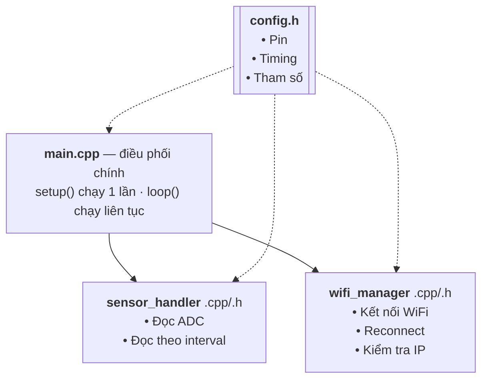
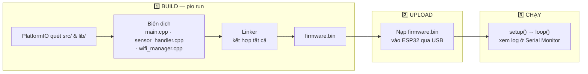
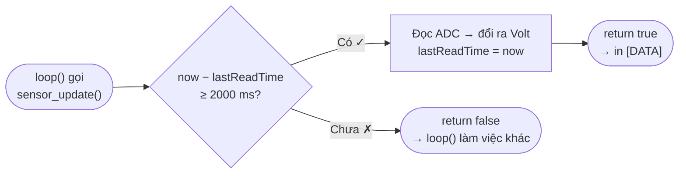

# ESP32 Project

## Mô tả
Template dự án ESP32 với cấu trúc bài bản, sử dụng PlatformIO + Arduino Framework.

## 📚 Tài liệu

| Tài liệu | Nội dung |
|----------|----------|
| [`docs/workflow.md`](docs/workflow.md) | Quy trình & tư duy hệ thống qua sơ đồ: kiến trúc, luồng `setup()`/`loop()`, máy trạng thái WiFi, quy trình Git, debug |
| [`docs/roadmap.md`](docs/roadmap.md) | Lộ trình P0 → P5, biểu đồ Gantt, checklist và tiêu chí hoàn thành để **làm theo tiến độ** |
| [`docs/pinout.md`](docs/pinout.md) | Sơ đồ chân ESP32 |

## Cấu trúc thư mục

```
esp32_project/
├── src/
│   ├── main.cpp              # Entry point chính
│   ├── wifi_manager.cpp      # Quản lý kết nối WiFi
│   └── sensor_handler.cpp    # Đọc dữ liệu cảm biến
├── include/
│   ├── config.h              # Cấu hình tập trung
│   ├── wifi_manager.h        # Header WiFi
│   └── sensor_handler.h      # Header Sensor
├── docs/
│   ├── pinout.md             # Sơ đồ chân
│   ├── workflow.md           # Quy trình & sơ đồ hệ thống
│   └── roadmap.md            # Lộ trình & tiến độ
├── lib/                      # Thư viện riêng
├── test/                     # Unit test
├── platformio.ini            # Cấu hình PlatformIO
└── README.md
```

## Kiến trúc



Chi tiết từng lớp và luồng chạy: xem [`docs/workflow.md`](docs/workflow.md).

## Cách sử dụng

### 1. Cài đặt
- Cài [VS Code](https://code.visualstudio.com/)
- Cài Extension [PlatformIO IDE](https://platformio.org/install/ide?install=vscode)

### 2. Cấu hình
Sửa file `include/config.h`:
- Thay `WIFI_SSID` và `WIFI_PASSWORD` bằng thông tin WiFi của bạn
- Cập nhật pin definitions theo mạch thực tế

> ⚠ Đừng commit mật khẩu WiFi thật lên GitHub — việc tách ra `secrets.h` nằm trong
> giai đoạn P1 của [roadmap](docs/roadmap.md).

### 3. Build & Upload
```bash
# Build project
pio run

# Upload lên ESP32
pio run --target upload

# Mở Serial Monitor
pio device monitor
```



Khi Build (`esp32dev`), log sẽ hiện:

```text
Compiling .pio/build/esp32dev/src/main.cpp.o
Compiling .pio/build/esp32dev/src/sensor_handler.cpp.o
Compiling .pio/build/esp32dev/src/wifi_manager.cpp.o
Linking .pio/build/esp32dev/firmware.elf
Building .pio/build/esp32dev/firmware.bin
```

### 4. Thêm thư viện
Sửa `platformio.ini`, thêm vào `lib_deps`:
```ini
lib_deps =
    knolleary/PubSubClient@^2.8
    bblanchon/ArduinoJson@^6.21.0
```

## Nguyên tắc code

1. **Non-blocking**: Dùng `millis()` thay vì `delay()`
2. **Modular**: Mỗi file = 1 chức năng
3. **Config tập trung**: Mọi hằng số đặt trong `config.h`
4. **Debug có cấp độ**: Dùng `DEBUG_PRINTLN()` macro

### Ví dụ non-blocking: `sensor_update()` đọc mỗi 2 giây



| Thời điểm gọi | `now − lastReadTime` | Kết quả |
|---------------|----------------------|---------|
| Lần đầu, ví dụ t = 3200 ms | 3200 − 0 = 3200 ≥ 2000 | ✓ Đọc ngay, `lastReadTime = 3200` |
| t = 3700 ms | 500 < 2000 | ✗ `return false` |
| t = 5200 ms | 2000 ≥ 2000 | ✓ Đọc, `lastReadTime = 5200` |
| t = 5700 ms | 500 < 2000 | ✗ `return false` |

> Lần gọi đầu tiên thường **đọc ngay** vì `setup()` đã chạy hơn 1 giây
> (`delay(1000)` + chờ WiFi). Sơ đồ thời gian đầy đủ: [workflow.md — Mục 7](docs/workflow.md#7-định-thời-non-blocking-với-millis).
