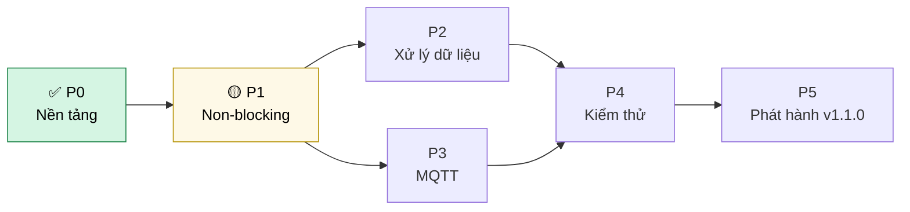
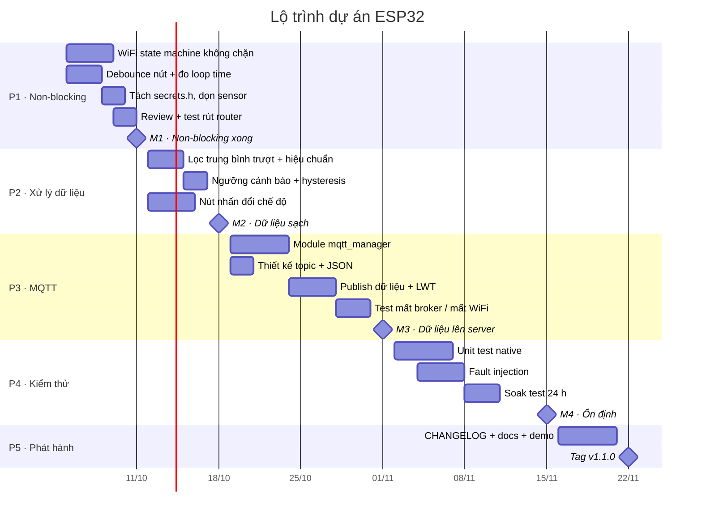
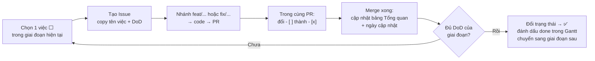

# Lộ trình & Tiến độ dự án

> Đây là tài liệu **để làm theo**. Mỗi giai đoạn có: mục tiêu, danh sách việc (checkbox),
> và **tiêu chí hoàn thành (Definition of Done — DoD)**. Xong việc nào thì tick việc đó
> trong cùng Pull Request.
>
> Lý do của từng việc được giải thích bằng sơ đồ trong [`workflow.md`](workflow.md).

**Cập nhật lần cuối:** 03/10/2026

## Tổng quan tiến độ

| Giai đoạn | Nội dung | Thời gian | Trạng thái | Tiến độ |
|-----------|----------|-----------|------------|---------|
| **P0** | Nền tảng: template, WiFi, cảm biến, LED | 05/2026 | ✅ Xong | 6/6 |
| **P1** | Chuẩn hóa non-blocking & an toàn mã nguồn | 05/10 → 11/10 | 🟡 Tiếp theo | 0/6 |
| **P2** | Xử lý dữ liệu & cảnh báo | 12/10 → 18/10 | ⚪ Chưa bắt đầu | 0/5 |
| **P3** | Kết nối IoT qua MQTT | 19/10 → 01/11 | ⚪ Chưa bắt đầu | 0/6 |
| **P4** | Kiểm thử & độ tin cậy | 02/11 → 15/11 | ⚪ Chưa bắt đầu | 0/5 |
| **P5** | Phát hành v1.1.0 | 16/11 → 22/11 | ⚪ Chưa bắt đầu | 0/5 |

Ký hiệu: ✅ Xong · 🔵 Đang làm · 🟡 Tiếp theo · ⚪ Chưa bắt đầu · 🔴 Bị chặn

---

## Sơ đồ phụ thuộc giữa các giai đoạn

Giai đoạn sau **chỉ bắt đầu khi** giai đoạn trước đạt DoD — vì nó xây trên nền móng đó.



> P2 và P3 **chạy song song** được (2 người làm P2, 2 người làm P3) vì chúng nằm ở hai
> module khác nhau và chỉ gặp nhau ở `main.cpp`.

## Biểu đồ Gantt



## Gợi ý phân công nhóm 4 người

| Vai trò | Phụ trách chính | Giai đoạn trọng tâm |
|---------|-----------------|---------------------|
| **A — Leader / Tích hợp** | Review PR, giữ `main` luôn chạy được, `main.cpp`, cập nhật roadmap | Tất cả, P5 |
| **B — Firmware core** | `wifi_manager`, nút nhấn, máy trạng thái | P1, P2 |
| **C — Dữ liệu & IoT** | `sensor_handler`, bộ lọc, `mqtt_manager` | P2, P3 |
| **D — Kiểm thử & Tài liệu** | `test/`, kịch bản fault injection, `docs/` | P4, viết test song song từ P1 |

---

## P0 · Nền tảng — ✅ Xong

**Mục tiêu:** có khung dự án chuẩn, build và nạp được, đọc được cảm biến.

- [x] Cấu trúc thư mục PlatformIO (`src/`, `include/`, `lib/`, `test/`, `docs/`)
- [x] Cấu hình tập trung `include/config.h` + debug macro
- [x] Sơ đồ chân `docs/pinout.md`
- [x] Module `wifi_manager` (kết nối, timeout, reconnect)
- [x] Module `sensor_handler` (ADC 12-bit, đọc theo chu kỳ)
- [x] LED nháy non-blocking bằng `millis()`

---

## P1 · Chuẩn hóa non-blocking & an toàn mã nguồn — 🟡 Tiếp theo

**Mục tiêu:** `loop()` không bao giờ bị chặn, kể cả khi mất WiFi.
**Vì sao:** xem các ô đỏ trong [workflow.md — Mục 5](workflow.md#5-luồng-chạy-liên-tục-loop).

- [ ] **Viết lại `wifi_check_connection()` thành máy trạng thái không chặn** — bỏ vòng
      `while` chờ 5 s; mỗi lần gọi chỉ đọc `WiFi.status()` rồi return
      ([sơ đồ đích](workflow.md#6-máy-trạng-thái-wifi))
- [ ] **Debounce nút nhấn bằng `millis()`** thay cho `delay(200)`; chỉ báo sự kiện ở
      **cạnh xuống** (lúc vừa nhấn), giữ nút không in lặp
- [ ] **Đo thời gian mỗi vòng `loop()`** — lưu giá trị lớn nhất, in ra mỗi 5 s
      (`[LOOP] max = x us`) làm bằng chứng non-blocking
- [ ] **Tách mật khẩu WiFi khỏi git**: tạo `include/secrets.h` (thêm vào `.gitignore`)
      + file mẫu `include/secrets.example.h`
- [ ] `sensor_read_voltage()` gọi lại `sensor_read_raw()` thay vì `analogRead()` lần hai
- [ ] Hạ log `[SENSOR] ...` xuống mức chi tiết để Serial không bị spam mỗi 2 s

**DoD:**
- Rút router ra trong lúc chạy → LED vẫn nháy đều 1 s, `[DATA]` vẫn in đều 2 s
- `[LOOP] max` < 10 ms trong mọi tình huống (trừ lần gọi `WiFi.begin()`)
- Cắm router lại → tự kết nối lại, không cần reset board
- `git grep PASSWORD` không lộ mật khẩu thật

---

## P2 · Xử lý dữ liệu & cảnh báo — ⚪

**Mục tiêu:** giá trị cảm biến ổn định, có cảnh báo khi vượt ngưỡng.

- [ ] Bộ lọc trung bình trượt (N = 10 mẫu) — hàm thuần, không phụ thuộc Arduino để
      unit test được ở P4
- [ ] Hiệu chuẩn ADC bằng `analogReadMilliVolts()` (ADC ESP32 không tuyến tính ở hai đầu dải)
- [ ] Ngưỡng cảnh báo `SENSOR_ALARM_HIGH` / `SENSOR_ALARM_LOW` trong `config.h`,
      có **hysteresis** để không bật/tắt liên tục quanh ngưỡng
- [ ] Khi cảnh báo: LED nháy nhanh (200 ms) thay vì 1 s
- [ ] Nút BOOT chuyển chế độ: `NORMAL` → `DEBUG` (in raw) → `SILENT`

**DoD:** dao động giá trị đọc khi để yên < ±0,02 V; vặn cảm biến qua ngưỡng
thì cảnh báo bật/tắt đúng **một lần**, không nhấp nháy.

---

## P3 · Kết nối IoT qua MQTT — ⚪

**Mục tiêu:** dữ liệu cảm biến lên được broker MQTT, chịu được mất kết nối.

- [ ] Thêm `knolleary/PubSubClient` và `bblanchon/ArduinoJson` vào `lib_deps`
- [ ] Module mới `include/mqtt_manager.h` + `src/mqtt_manager.cpp`
      (`mqtt_init()`, `mqtt_update()`, `mqtt_publish()`) — reconnect **không chặn**
- [ ] Thiết kế topic: `esp32/<device_id>/sensor`, `esp32/<device_id>/status`
- [ ] Gửi JSON: `{"v": 1.65, "alarm": false, "rssi": -60, "uptime": 123456}`
- [ ] Last Will (LWT): broker tự báo `offline` khi board mất kết nối
- [ ] Test: tắt broker / mất WiFi → firmware không treo, có lại thì tự gửi tiếp

**DoD:** chạy `mosquitto_sub -t 'esp32/#' -v` thấy dữ liệu đều mỗi 2 s;
tắt broker 1 phút rồi bật lại → tự phục hồi trong < 10 s.

---

## P4 · Kiểm thử & độ tin cậy — ⚪

**Mục tiêu:** chứng minh hệ thống đúng bằng test, không chỉ "chạy thử thấy được".

- [ ] Thêm môi trường `[env:native]` vào `platformio.ini`; unit test bộ lọc và logic
      ngưỡng bằng `pio test -e native` (chạy trên máy tính, không cần board)
- [ ] Checklist integration test trên board (theo DoD của P1–P3)
- [ ] Fault injection: rút WiFi, tắt broker, nối GPIO34 xuống GND / lên 3V3, rút cảm biến
- [ ] Soak test 24 h: log `ESP.getFreeHeap()` mỗi phút → heap không giảm dần
- [ ] Ghi kết quả test vào `docs/test_report.md`

**DoD:** toàn bộ unit test pass; 24 h không reset, heap ổn định.

---

## P5 · Phát hành v1.1.0 — ⚪

- [ ] Cập nhật `PROJECT_VERSION` trong `config.h` thành `"1.1.0"`
- [ ] Viết `CHANGELOG.md` (thêm gì, sửa gì so với 1.0.0)
- [ ] Cập nhật `README.md`, `docs/pinout.md`, `docs/workflow.md` khớp code
- [ ] Quay video demo (bình thường + mất WiFi + cảnh báo)
- [ ] Tạo tag `v1.1.0` trên GitHub Release kèm `firmware.bin`

---

## Cách cập nhật tiến độ



Trong biểu đồ Gantt, thêm từ khóa vào trước mã công việc để đổi màu:
`done` (xong), `active` (đang làm), `crit` (bị trễ / quan trọng). Ví dụ:

```text
WiFi state machine không chặn       :done, p1a, 2026-10-05, 4d
Debounce nút + đo loop time         :active, p1b, 2026-10-05, 3d
```

**Họp nhóm hằng tuần (15 phút)** — mỗi người trả lời 3 câu:
1. Tuần trước đã tick được việc nào?
2. Tuần này làm việc nào?
3. Có gì đang **chặn** mình không? (→ ghi 🔴 vào bảng Tổng quan)
