# Quy trình dự án & Tư duy hệ thống

> Tài liệu này giải thích dự án **bằng sơ đồ**: hệ thống được chia thế nào, chạy ra sao,
> và nhóm làm việc theo quy trình nào. Đọc theo thứ tự từ trên xuống — mỗi phần là một
> "góc nhìn" khác nhau về cùng một hệ thống.
>
> Lộ trình và bảng tiến độ để làm theo nằm ở [`roadmap.md`](roadmap.md).

Sơ đồ viết bằng [Mermaid](https://mermaid.js.org/) — GitHub và VS Code (extension
*Markdown Preview Mermaid Support*) tự vẽ ra hình.

## Mục lục

1. [Bản đồ các góc nhìn](#1-bản-đồ-các-góc-nhìn)
2. [Tư duy hệ thống: V-Model](#2-tư-duy-hệ-thống-v-model)
3. [Kiến trúc phân lớp của firmware](#3-kiến-trúc-phân-lớp-của-firmware)
4. [Luồng khởi động `setup()`](#4-luồng-khởi-động-setup)
5. [Luồng chạy liên tục `loop()`](#5-luồng-chạy-liên-tục-loop)
6. [Máy trạng thái WiFi](#6-máy-trạng-thái-wifi)
7. [Định thời non-blocking với `millis()`](#7-định-thời-non-blocking-với-millis)
8. [Pipeline Build → Upload → Chạy](#8-pipeline-build--upload--chạy)
9. [Vòng lặp phát triển hằng ngày](#9-vòng-lặp-phát-triển-hằng-ngày)
10. [Quy trình Git cho nhóm 4 người](#10-quy-trình-git-cho-nhóm-4-người)
11. [Quy trình thêm một tính năng mới](#11-quy-trình-thêm-một-tính-năng-mới)
12. [Cây quyết định debug phần cứng](#12-cây-quyết-định-debug-phần-cứng)

---

## 1. Bản đồ các góc nhìn

Một hệ thống nhúng nên được nhìn từ nhiều góc. Mỗi góc trả lời một câu hỏi khác nhau:

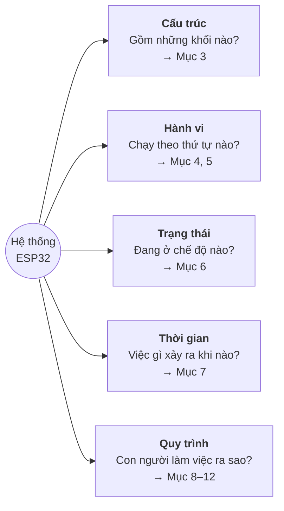

| Góc nhìn   | Loại sơ đồ             | Câu hỏi trả lời                                 |
|------------|------------------------|-------------------------------------------------|
| Cấu trúc   | Block diagram          | Module nào phụ thuộc module nào?                |
| Hành vi    | Flowchart              | Code chạy theo nhánh nào?                        |
| Trạng thái | State machine          | Hệ thống phản ứng thế nào khi có sự kiện?       |
| Thời gian  | Sequence / timeline    | Có chỗ nào **chặn** (blocking) CPU không?       |
| Quy trình  | Workflow / Gantt       | Ai làm gì, theo thứ tự nào, khi nào xong?       |

---

## 2. Tư duy hệ thống: V-Model

Ngành ô tô (ASPICE, ISO 26262) phát triển phần mềm theo **V-Model**: nhánh trái đi
xuống là *thiết kế*, nhánh phải đi lên là *kiểm chứng*. Mỗi tầng bên trái có một tầng
kiểm thử tương ứng bên phải.

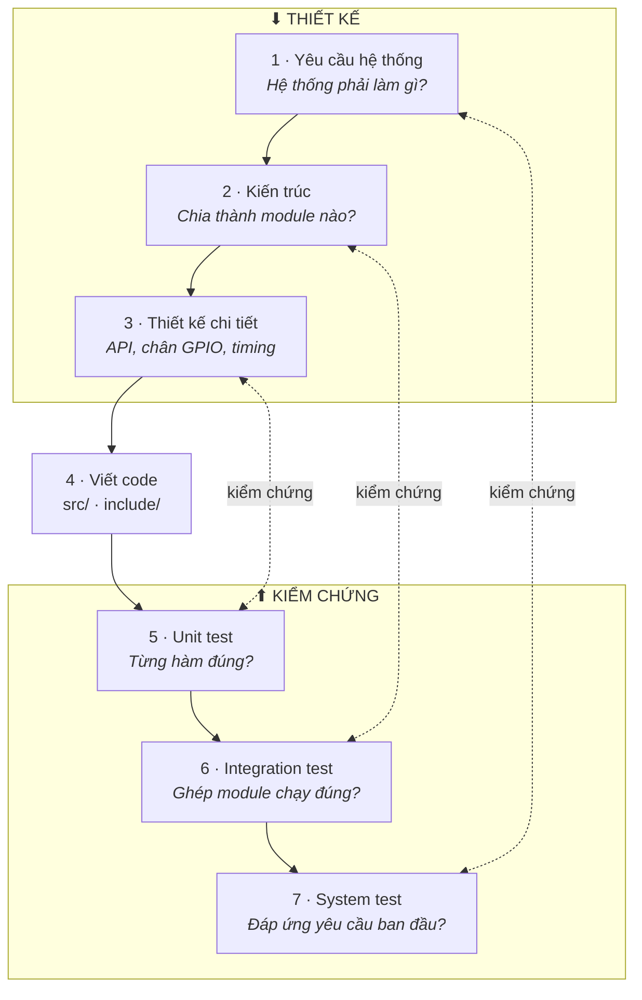

**Áp vào dự án này:**

| Tầng | Sản phẩm trong repo | Kiểm chứng bằng |
|------|---------------------|-----------------|
| Yêu cầu | `README.md` — mô tả, `roadmap.md` — mục tiêu từng giai đoạn | System test: chạy board, đối chiếu từng yêu cầu |
| Kiến trúc | Mục 3 của tài liệu này | Integration test: WiFi + sensor + LED chạy cùng lúc |
| Thiết kế chi tiết | `include/*.h`, `include/config.h`, `docs/pinout.md` | Unit test trong `test/` |
| Code | `src/*.cpp` | Build không lỗi, không warning |

> 💡 **Quy tắc vàng:** viết yêu cầu và tiêu chí kiểm thử **trước** khi viết code.
> Nếu không nói được "thế nào là xong", thì chưa nên bắt đầu.

---

## 3. Kiến trúc phân lớp của firmware

*(Vẽ lại từ sơ đồ ASCII "MAIN.CPP điều phối chính" trong README.)*

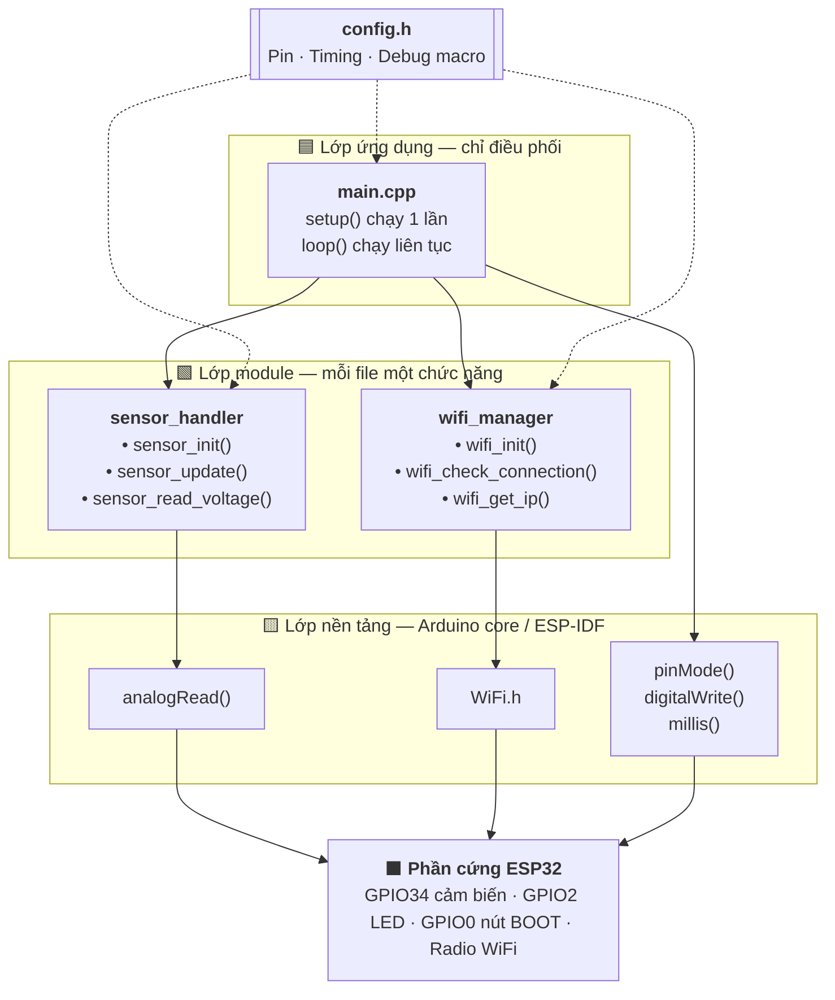

**Ba luật của kiến trúc phân lớp:**

1. **Mũi tên chỉ đi xuống.** `main.cpp` gọi module, module **không bao giờ** gọi ngược `main.cpp`.
2. **Module không biết nhau.** `sensor_handler` không `#include "wifi_manager.h"`. Nếu cần
   phối hợp (ví dụ gửi dữ liệu cảm biến qua WiFi) thì `main.cpp` làm cầu nối.
3. **Mọi hằng số nằm ở `config.h`.** Đổi chân, đổi chu kỳ — chỉ sửa một chỗ.

> 🚗 Đây chính là ý tưởng của **AUTOSAR**: Application → RTE → Basic Software → MCU.
> Dự án nhỏ này là phiên bản thu gọn của cùng tư duy đó.

---

## 4. Luồng khởi động `setup()`

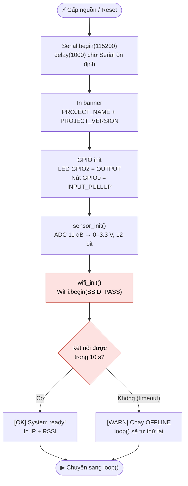

> 🟥 Ô đỏ = đoạn **chặn** CPU (blocking). Trong `setup()` chấp nhận được vì chỉ chạy
> một lần, nhưng thời gian khởi động có thể kéo dài tới ~11 giây khi không có WiFi.

---

## 5. Luồng chạy liên tục `loop()`

`loop()` là một **super-loop**: 4 tác vụ được kiểm tra lần lượt, mỗi tác vụ tự hỏi
"đã đến lúc làm chưa?" rồi trả quyền cho tác vụ tiếp theo.

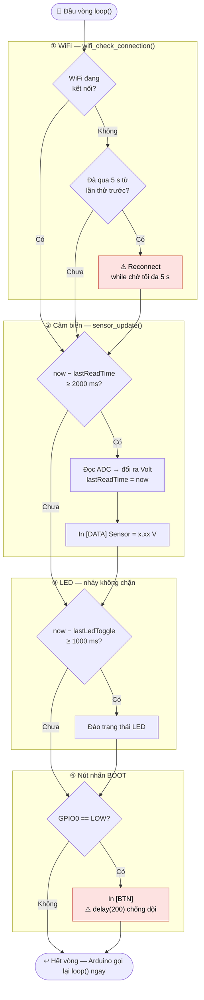

### 🔍 Tư duy hệ thống: tìm "điểm nghẽn"

Nguyên tắc số 1 của dự án là **non-blocking**, nhưng sơ đồ trên lộ ra 2 chỗ vi phạm (ô đỏ):

| Vị trí | Chặn bao lâu | Hậu quả |
|--------|--------------|---------|
| `wifi_check_connection()` — vòng `while` chờ reconnect | tới **5 s**, lặp lại mỗi ~5 s khi mất WiFi | Cảm biến lỡ nhịp đọc 2 s, LED đứng hình, nút nhấn không phản hồi |
| `delay(200)` sau khi nhấn nút | 200 ms mỗi lần, **lặp liên tục khi giữ nút** | Giữ nút sẽ in `[BTN]` liên tục ~5 lần/giây |

Đây là ví dụ điển hình vì sao phải vẽ sơ đồ: đọc từng file thì thấy ổn, nhưng nhìn
**toàn hệ thống** mới thấy một module làm "đói" các module khác. Cách sửa nằm trong
**Giai đoạn P1** của [`roadmap.md`](roadmap.md).

---

## 6. Máy trạng thái WiFi

Hành vi hiện tại của `wifi_manager.cpp`, vẽ dưới dạng máy trạng thái:

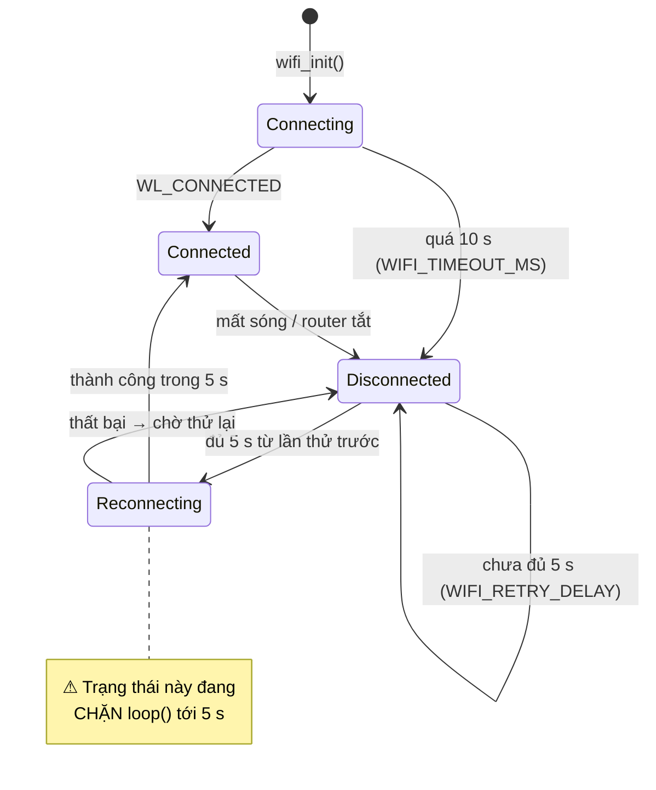

**Mục tiêu P1** — tách `Reconnecting` thành trạng thái *không chặn*: mỗi lần `loop()`
gọi vào chỉ kiểm tra `WiFi.status()` một lần rồi trả về ngay.

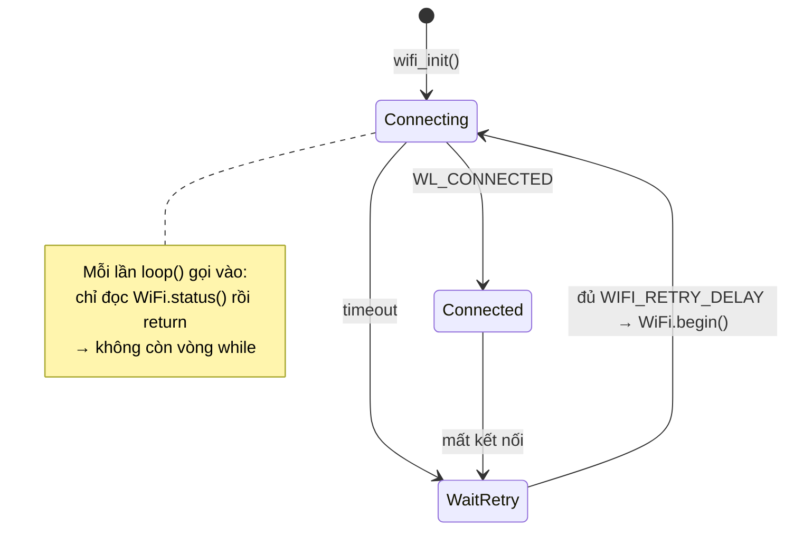

---

## 7. Định thời non-blocking với `millis()`

*(Vẽ lại từ ví dụ "Lần lặp đầu tiên / 2000 ms sau / 2500 ms sau" trong README.)*

Ý tưởng: thay vì **ngủ** chờ (`delay`), mỗi vòng lặp **nhìn đồng hồ** rồi quyết định.

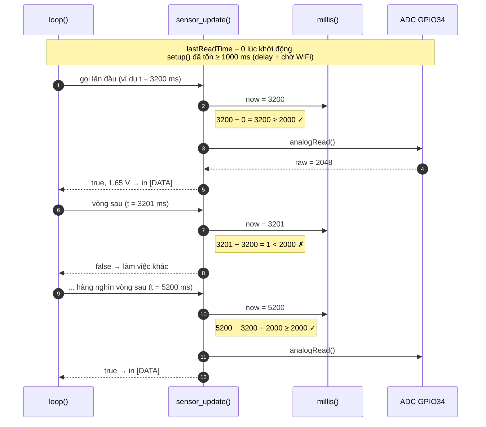

> ⚠ **Đính chính README cũ:** lần gọi đầu tiên **thường đọc ngay** chứ không trả `false`,
> vì `setup()` đã chạy hơn 1 giây (`delay(1000)` + chờ WiFi) nên `millis() − 0` đã vượt 2000 ms
> trong đa số trường hợp.
>
> 💡 Phép trừ `now - lastReadTime` với kiểu `unsigned long` vẫn đúng cả khi `millis()`
> tràn số sau ~49,7 ngày — đây là lý do **không** viết `now >= lastReadTime + 2000`.

---

## 8. Pipeline Build → Upload → Chạy

*(Vẽ lại từ sơ đồ "1️⃣ BUILD / 2️⃣ UPLOAD" trong README.)*

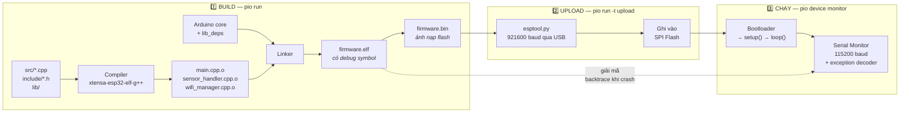

Log build tương ứng:

```text
Compiling .pio/build/esp32dev/src/main.cpp.o
Compiling .pio/build/esp32dev/src/sensor_handler.cpp.o
Compiling .pio/build/esp32dev/src/wifi_manager.cpp.o
Linking .pio/build/esp32dev/firmware.elf
Building .pio/build/esp32dev/firmware.bin
```

---

## 9. Vòng lặp phát triển hằng ngày

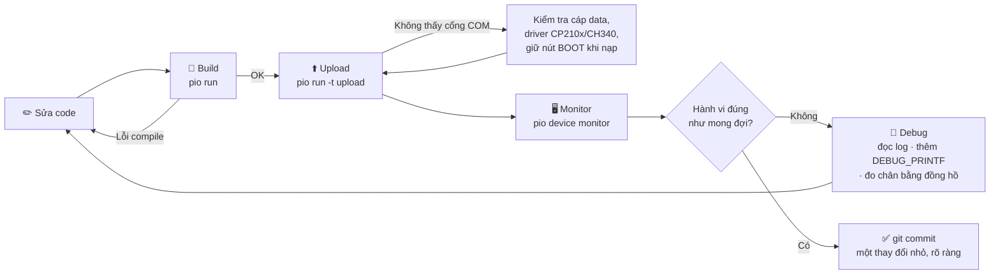

> 💡 Vòng lặp càng ngắn càng tốt. Sửa ít → build → test ngay. Đừng viết 300 dòng rồi
> mới nạp lần đầu.

---

## 10. Quy trình Git cho nhóm 4 người

### 10.1 Mô hình nhánh

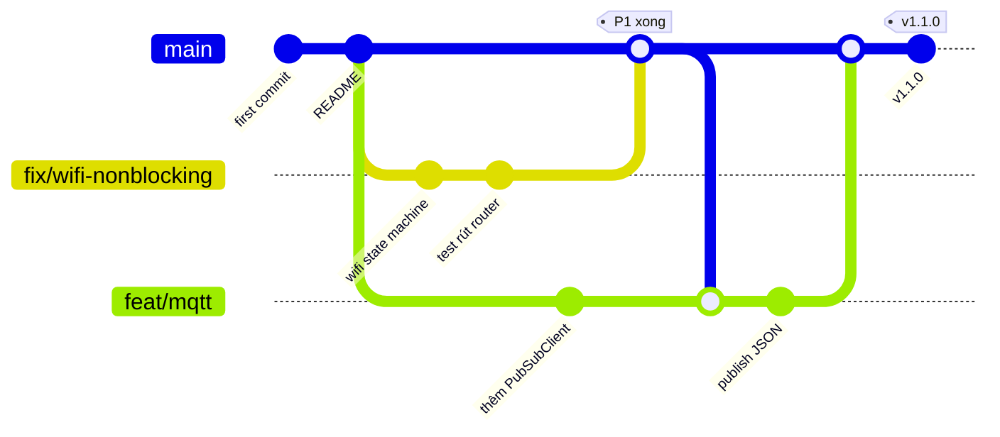

- `main` **luôn build được và nạp được**. Không ai commit thẳng vào `main`.
- Mỗi việc = 1 nhánh: `feat/...` (tính năng), `fix/...` (sửa lỗi), `docs/...` (tài liệu).
- Trước khi merge, kéo `main` mới nhất vào nhánh của mình để giải quyết xung đột sớm.

### 10.2 Vòng đời một công việc

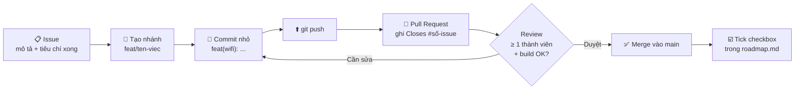

### 10.3 Quy ước commit message

| Tiền tố | Dùng khi | Ví dụ |
|---------|----------|-------|
| `feat:` | Thêm tính năng | `feat(mqtt): publish sensor data dạng JSON` |
| `fix:` | Sửa lỗi | `fix(wifi): bỏ vòng while chặn khi reconnect` |
| `refactor:` | Đổi cấu trúc, không đổi hành vi | `refactor(sensor): dùng chung sensor_read_raw()` |
| `docs:` | Tài liệu | `docs: cập nhật pinout cho relay` |
| `test:` | Thêm/sửa test | `test: unit test bộ lọc trung bình trượt` |

---

## 11. Quy trình thêm một tính năng mới

Trước khi gõ code cho bất kỳ tính năng nào, đi qua sơ đồ này:

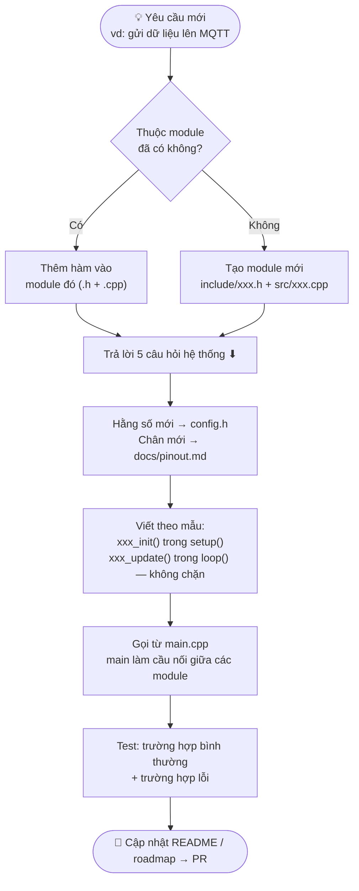

**5 câu hỏi hệ thống** (rút gọn từ tư duy FMEA trong ô tô):

| # | Câu hỏi | Ví dụ với MQTT |
|---|---------|----------------|
| 1 | **Đầu vào** là gì? | Giá trị Volt từ `sensor_update()` |
| 2 | **Đầu ra** là gì? | Gói JSON tới topic `esp32/<id>/sensor` |
| 3 | **Trạng thái** cần nhớ? | Đã kết nối broker chưa, lần gửi cuối |
| 4 | **Thời gian**: bao lâu làm 1 lần, có chặn không? | Mỗi 2 s, `client.loop()` phải trả về ngay |
| 5 | **Khi lỗi** thì sao? | Mất WiFi → bỏ qua gửi, không treo; broker chết → thử lại sau 5 s |

---

## 12. Cây quyết định debug phần cứng

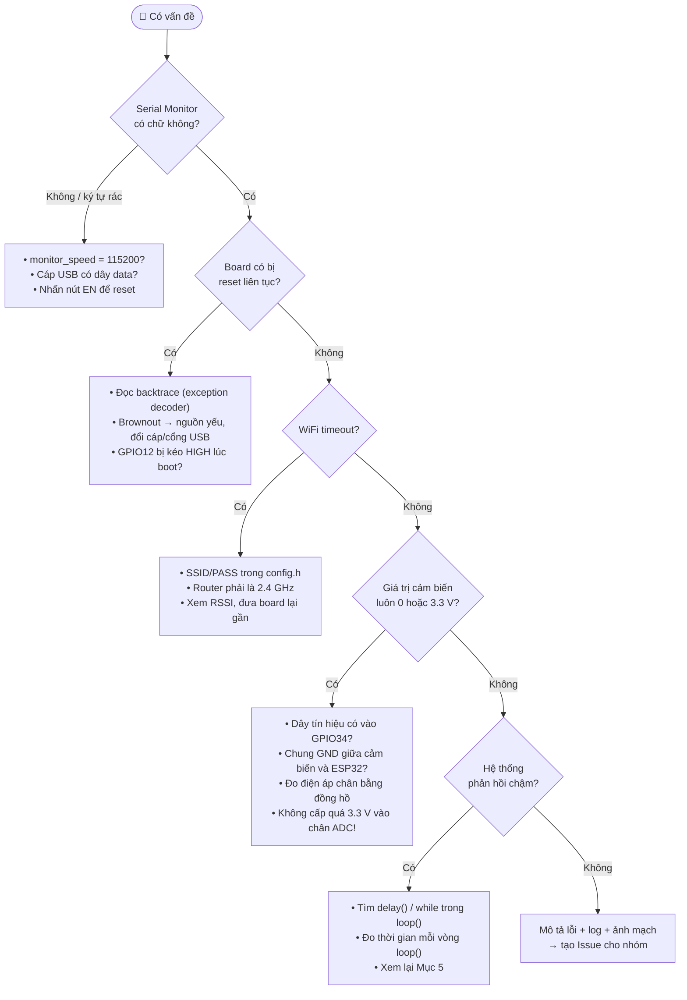

> 💡 **Chia đôi để khoanh vùng:** khi không rõ lỗi ở đâu, tắt một nửa hệ thống
> (comment `wifi_check_connection()` chẳng hạn). Lỗi còn hay mất? Lặp lại với nửa còn lại.
